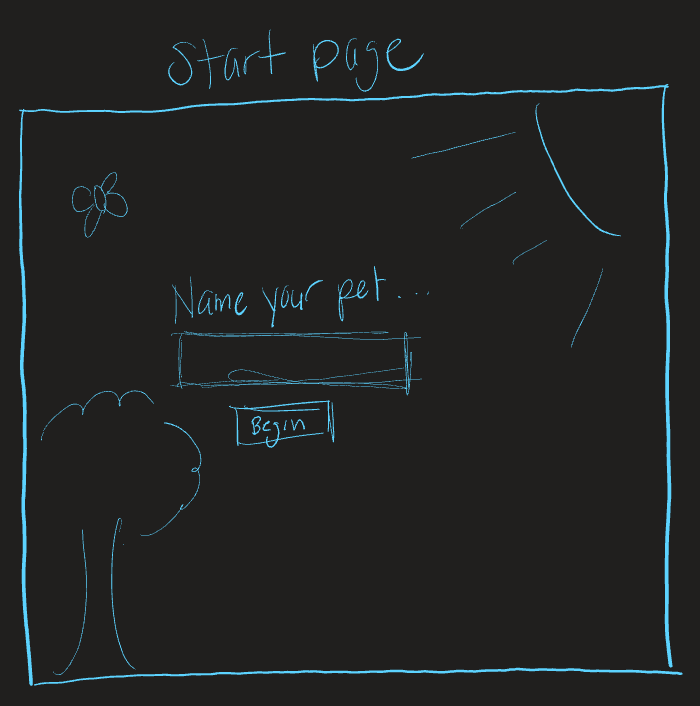

# User Stories
### Landing Page
- the user is greeted in the landing page where a tomagatchi image slides into view
- the user is prompted to enter their pet's name into the input field
- Once the user inputs their pet's name and clicks the "Submit" button, the game phases into the main core mechanics.

### Core Game Mechanic Walkthrough
- the user will now see that their pet avatar is dancing across the screen in linear fashion.
- on the right side of the screen, the following meters of "Hungry", "Energy", "Happy" and "Age" are displayed, below the Name of the avatar.  These meters immediately begin counting down once the user enters this stage.
- All meters start out at a value of 10 and decrease in value by one unit every second. 
- If the user presses the "HUNGRY!" button - the Hunger meter increases by one
- If the user presses the "Need Energy!" button - the Energy meter inreases by one
- If the user presses the "Play with me!" button - the Happy meter increases by one
- The Age of the avatar increases by one year every two seconds.  
- The avatar image will change once it passes certain the age thresholds of 18 (adolescent) and 30 (adulthood).  Notice the 30 year old dragon is quite the firebreather!    
- the main page contains 3 buttons the user will have to continuously click to keep the number value of the aforementioned meters above 0.  

### Death Page
- If any of the meters reaches 0, the game immediately ends and switches to a screen that displays a tombstone for the avatar, the meters have stopped and a simple phrase saying that the name of the avatar has died.  

# Technologies Used

- I refrained from using any CSS frameworks or Libraries from the time being, being that I want to keep sharpening my skill in vanilla CSS.  The depth of CSS functionality I used was using @keyframes and the animation property.

### JQUERY
- I used Jquery to manipulate the DOM.  Specifically, adding event listeners, appending, preppending elements to the DOM, and adding pictures.  

### GOOGLE FONTS
- I imported the Princess Sofia font from Google Fonts. 

### IMAGES
- I used imported pictures from the internet to stylize.

# Approach Taken

- I took an Object Oriented Programming approach whereas I stored 99 % of the functionality of the program into the Object of "tomagatchi".  

### Wireframes

